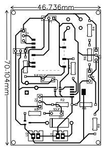
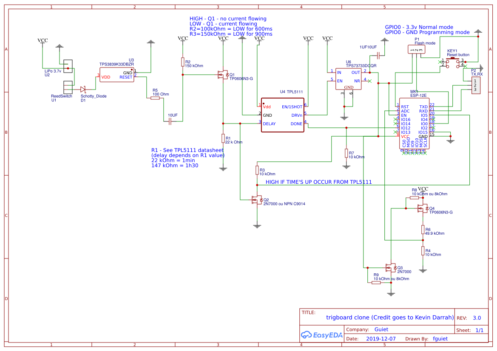
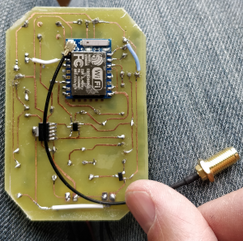

# TrigBoard Clone version

## Forewords

This project is nothing but a less elaborated Kevin Darrah's trigboard.

As a consequence, all credits goes to [Kevin Darrah](https://www.kevindarrah.com/wiki/index.php?title=TrigBoard), [Kevin's Github](https://github.com/krdarrah)

## Description / use cases

This board does nothing else than pushing you a notification triggered by a digital input.

It can be used in very different use cases such as open/close door monitoring, flood detection, motion sensor and so forth.

At the moment, I've got two instances of this trigboard clone running at home. One of this little creature lives next to my garage door, the other under my mailbox. I get notified via short messages each time either my garage has been opened or when I get mails. Convenient, isn't it ?

Technically speaking, notifications are sent using MQTT on different topics. Then, got a Node-RED server running on one of my Raspberry Pi handling those notifications. Typically, Node-RED does nothing but creating short messages using a USB 3G Modem.

## Specifications

* Consume (far) less then 1uA ([Current Ranger](https://lowpowerlab.com/guide/currentranger/) reports 180nA !!)
* Based on ESP8266 WiFi Module (Tested with ESP12E and ESP07 with external antenna)
* Dimension : 4.6 cm x 7 cm
* Works with any 3.7v Lithium polymer battery 
* Notifications are pushed using MQTT

## Bill of Materials

TODO

## Datasheet

* PCB - TrigBoard Clone - Revision 3 - 2019/12/21

* Schematic - TrigBoard Clone - Revision 3 - 2019/12/21

## In real life

